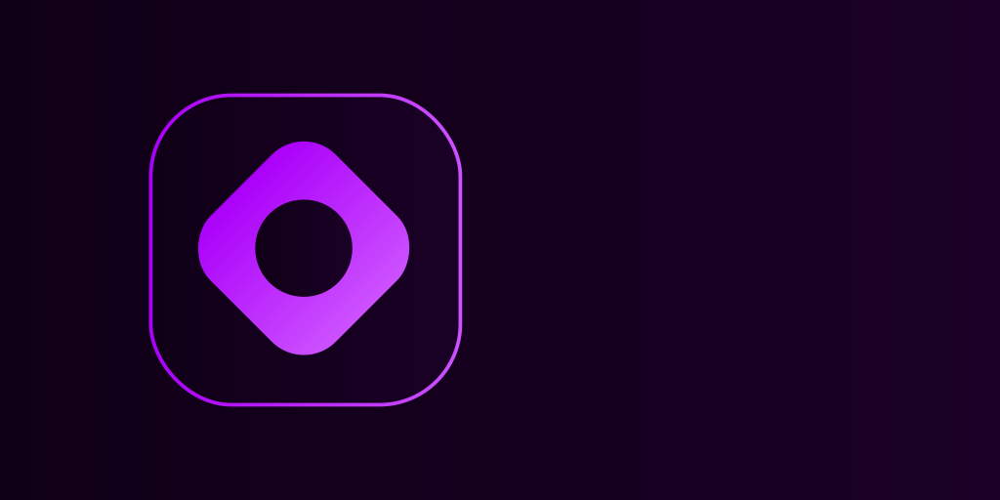

</img>
<h3 align="center">Gaffer: A project manager for modern C++</h3>

## Description
Gaffer is a project manager for modern C++ heavily inspired by Cargo for the Rust programming language. Gaffer aims to be customizable, fast, pretty, and easy to use.

> **NOTE**  
> Gaffer is currently in alpha and is being actively developed.  
> If you encounter any bugs, and/or have any proposals, please, [raise an issue](https://github.com/nitrogenez/gaffer/issues/new).

## Contributing
If you wish to contribute to Gaffer, there are steps you need to follow:

+ **Step 1**: Fork the [gaffer repository](https://github.com/nitrogenez/gaffer)
+ **Step 2**: Start a new branch via `git checkout` with the name like `some-feature/fix`
+ **Step 3**: Make your changes
+ **Step 4**: [Open a merge request](https://github.com/nitrogenez/gaffer/compare)
+ **Step 5**: Wait for the Gaffer maintainers to review your request

## Code styling
There are no any rules on what the code should look like.  
Write it as you feel to be writing. Just use a 4-space identation, and you are GTG.

## Building
Gaffer uses `meson` as a build system, at the moment, so just use two simple commands:

+ `meson setup build`
+ `meson compile -C build`

## License
Gaffer is licensed under **BSD-3-Clause "New" or "Revised" License**. See [LICENSE](LICENSE.md) to know more.
